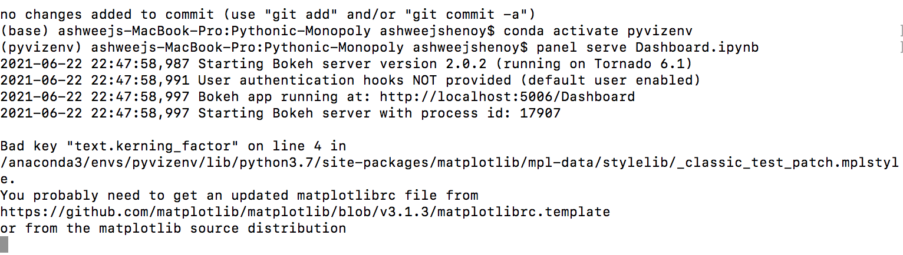
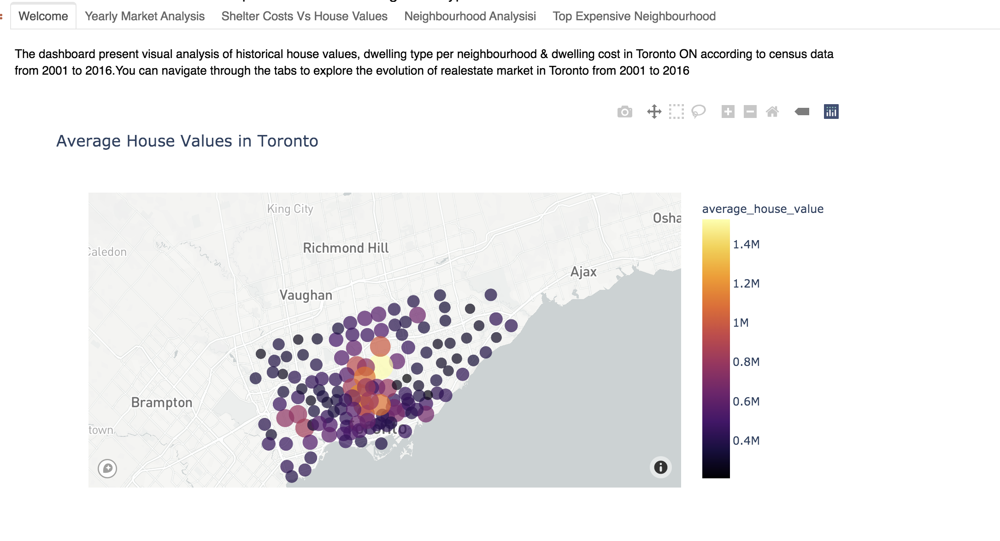

# **Pythonic-Monopoly**


---

## **Background**
Harold's company has just started a new Real Estate Investment division to provide customers with a broader range of portfolio options. Harold was tasked with building a prototype dashboard, and he needs your help. The real estate team wants to trial this initial offering with investment opportunities for the Toronto market. If the new service is popular, then they can start to expand to other markets.

---

## **Objective**
To create a Dashboard that provides chart, maps, and interactive visualizations to help users explore the data and determine if they want to invest in rental properties in Toronto.

---
## **Steps**

**Part 1: Rental Analysis**

1. Import necessary libraries, API key and load the data from CSV files
2. Calculate the number of dwelling types per year and visualize the results as a bar chart using the Pandas plot function.
3. Calculate average monthly shelter costs per year  for owned and rented dwelling to understand rental income trends over time. Plot the results through line chart.
4. To understand the sales price of the rental property over time, calculate average house value over the years and visualiza the results through line chart
5. To compare house values across neighbourhood over the years, calculate mean house value across neighhourhood per year. Using hvplot, visualize the results through interactive line chart 
6. Visualize the number of dwelling types per year in each neighbourhood through interactive hvplot
7. Filter the data to identify the top 10 expensive neighbourhood  based on average hosue value and plot a bar chart
8. Read  neighbourhood location data and build an interactive map with the average prices per neighbourhood using Use a scatter Mapbox object from Plotly express
9. Cost Analysis through bar chart row facet to plot the average house values for all Toronto neighbourhoods per year and sunburst chart of most expensive neighbourhood in Toronto.


**Part 2: Dashboard**

*  Using the Panel library  build an interactive dashboard for all of the visualizations done in Part 1


---
## **Technologies/Tools**
1. Python
2. Pandas
3. Matplotlib
4. Panel
5. Holoviz
6. Mapbox API
7. Plotly
8. Jupyter Notebook
9. PyViz

---
## **Data**

Historical Housing  Data for the Toronto ON is based on census data aret stored in the CSV files in Data Folder

1. [Toronto Neighbourhood Census Data](Data/toronto_neighbourhoods_census_data.csv)
2. [Toronto Neighbourhood Geographical Coordinates](Data/toronto_neighbourhoods_coordinates.csv)


---
## **Code**
* [Rental Analysis](rental_analysis.ipynb)
* [DashBoard](Dashboard.ipynb)

---
## **Using the Dashboard**
The dashboard shows the real estate analysis for Toronto real estate market from 2001 to 2016. To run the dashboard from Terminal or Gitbash



1. Navigate to the main folder where the project is cloned from github
2. Run the below in Terminal/Gitbash as shown in the screenshot above
```sh
       conda activate pyvizenv
   ```
3. Run the jupyter notebook [DashBoard](Dashboard.ipynb)
```sh
      panel serve Dashboard.ipynb
```
---
## Ouput

**Sample outputs** stored in Output folder

1. Bar chart showing dwelling type per year

   |**Dwelling Types in Toronto in 2001**|**Dwelling Types in Toronto in 2006**|
   | :------------- | :----------|
   |||
   |**Dwelling Types in Toronto in 2011**|**Dwelling Types in Toronto in 2016**|
   |||

2.  Line Chart showing Average Cost of Owned & Rented Dwelling
    
    |**Average Monthly Shelter Cost for Owned Dwelling**|**Average Monthly Shelter Cost for Rented Dwelling**|
    | :------------- | :----------|
    |||

3. Average House Value in Toronto

   

4. Interactive line chart of Average house value per neighbourhood
    
     

5. Interactive bar chart of the number of dwelling types per neighbourhood

     

6. Bar chart showing average house value in Top 10 expensive neighbourhood
   
   

7. Interactive map with the average house value per neighbourhood
   
   

8. Facet Bar chart showing average house value in Toronto per neighbourhood across years

   

9. Sunburst chart showcasing costs analysis of most expensive neighbourhoods in Toronto per year
   
   

10. Dashboard

     


----
## **Troubleshooting**

1. First, make sure you are not importing hvplot.pandas before a pn.extension().  Loading hvplot.pandas first initializes a Holoviews extension and causes the Panel extension to fail.

2. Sometimes Bokeh server doesnot automatically launch the webpage with the dashboard. In such cases, copy the hyperlink appearing the terminal/gitbash and paste it new browsing tab to view the dashboard.

      

For example,In the above screenshot the hyperlink is 
```sh
      http://localhost:5006/Dashboard
```

